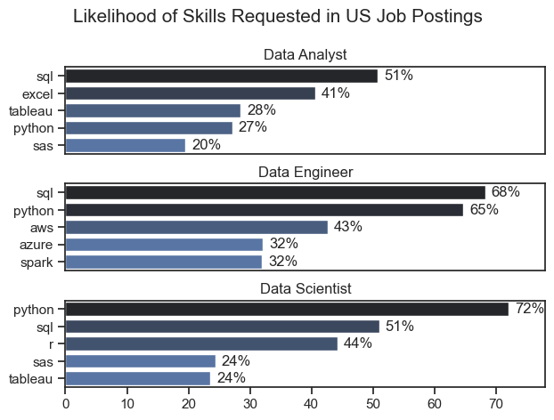
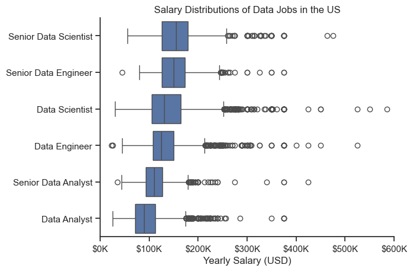
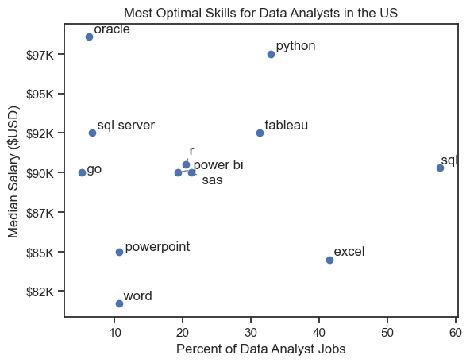

# Data Analyst Job Market Analysis

## Overview

This project analyzes the U.S. data job market using a real-world dataset of job postings. The objective is to identify hiring trends, in-demand skills, salary patterns, and the most valuable skills for aspiring Data Analysts.

Using Python, Pandas, Matplotlib, and Seaborn, the project explores the relationship between skill demand and compensation through a series of five analytical notebooks. The analysis focuses on helping job seekers understand which skills are most requested by employers and which provide the strongest salary potential.

The dataset was sourced from Luke Barousse's Data Jobs Dataset and contains information on job titles, salaries, locations, skills, and job characteristics across the data industry.

---

# Project Questions

This project aims to answer the following questions:

1. What does the overall data job market look like?
2. What skills are most demanded for major data roles?
3. How are Data Analyst skills trending over time?
4. How well do data roles and skills pay?
5. Which skills offer the best combination of demand and salary?

---

# Tools Used

### Python

Primary language used for data cleaning, analysis, and visualization.

### Libraries

* **Pandas** – Data cleaning, transformation, and analysis
* **Matplotlib** – Data visualization
* **Seaborn** – Statistical visualizations
* **adjustText** – Improved chart label readability

### Development Tools

* **Jupyter Notebook** – Interactive analysis environment
* **Visual Studio Code** – Code development and project management
* **Git & GitHub** – Version control and project hosting

---

# Project Structure

```text
├── 1_Data_Jobs_EDA.ipynb
├── 2_Skill_Demand_Analysis.ipynb
├── 3_Skill_Trend_Analysis.ipynb
├── 4_Salary_and_Skill_Compensation_Analysis.ipynb
├── 5_Optimal_Skills_Analysis.ipynb
├── images/
└── README.md
```

---

# Data Preparation

## Import and Clean Data

The dataset was loaded using the Hugging Face Datasets library and cleaned for analysis by:

* Converting date columns into datetime format
* Converting skill lists from string format into Python lists
* Handling missing values where necessary
* Filtering records based on analysis requirements

```python
import ast
import pandas as pd
from datasets import load_dataset

dataset = load_dataset('lukebarousse/data_jobs')
df = dataset['train'].to_pandas()

df['job_posted_date'] = pd.to_datetime(df['job_posted_date'])
df['job_skills'] = df['job_skills'].apply(
    lambda x: ast.literal_eval(x) if pd.notna(x) else x
)
```

## Focus on the U.S. Market

Most analyses in this project focus on job postings located in the United States.

```python
df_US = df[df['job_country'] == 'United States']
```

---

# Analysis and Findings

## 1. Exploratory Data Analysis

This notebook explores the overall data job market by examining:

* Distribution of job roles
* Geographic hiring trends
* Top hiring companies
* Remote work opportunities
* Data Analyst opportunities in the United States

### Key Insights

* Data Analyst, Data Engineer, and Data Scientist are among the most frequently posted roles.
* The United States accounts for a significant share of job postings.
* Remote work opportunities represent a meaningful portion of available jobs.
* Data Analyst hiring is concentrated in major metropolitan areas.

---

## 2. Skill Demand Analysis

This analysis identifies the most requested skills for the three most common data roles:

* Data Analyst
* Data Engineer
* Data Scientist

### Key Insights

* SQL remains one of the most requested skills across all three roles.
* Python is highly demanded across Data Engineering and Data Science positions.
* Data Engineers require more infrastructure-focused skills such as cloud and data processing technologies.
* Data Analysts place greater emphasis on reporting and business intelligence tools.

### Example Visualization



---

## 3. Skill Trend Analysis

This notebook examines how demand for Data Analyst skills changes throughout the year.

### Key Insights

* SQL remains one of the most consistently requested skills.
* Demand for core analytical skills remains relatively stable over time.
* Excel, Tableau, Python, and Power BI continue to appear frequently in job postings.
* Long-term demand is generally more stable than seasonal.

### Example Visualization


---

## 4. Salary and Skill Compensation Analysis

This analysis explores salary distributions across major data roles and identifies which skills are associated with higher compensation for Data Analysts.

### Key Insights

* Salary levels vary substantially across data-related roles.
* Specialized technical and engineering roles generally command higher salaries.
* Certain niche skills are associated with significantly higher compensation.
* High-paying skills are not always the most frequently requested skills.

### Example Visualization



---

## 5. Optimal Skills Analysis

This notebook combines salary and demand metrics to identify the most valuable skills for Data Analysts.

### Key Insights

* Some skills offer both strong demand and strong salary potential.
* Frequently requested skills often provide the best balance between employability and compensation.
* Programming, database, and analytical technologies show strong long-term value.
* Skill selection can significantly influence career opportunities and earning potential.

### Example Visualization



---

# Overall Insights

The analysis reveals several important trends within the U.S. data job market:

* SQL remains a foundational skill across data roles.
* Python continues to be one of the most valuable technical skills.
* Specialized technical skills can command premium salaries.
* High demand does not always correspond to the highest salaries.
* The strongest career opportunities often come from skills that balance demand and compensation.

---

# Conclusion

This project provides a data-driven overview of the U.S. data job market, with a particular focus on Data Analyst roles.

Through exploratory analysis, skill demand analysis, trend analysis, salary analysis, and skill optimization, the project demonstrates how data can be used to make informed career decisions.

The findings highlight the importance of balancing market demand with salary potential when selecting skills to develop, helping aspiring analysts prioritize learning and professional growth.
